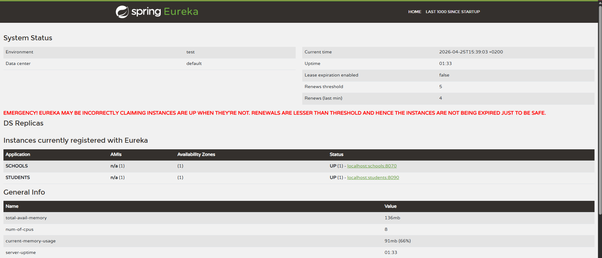
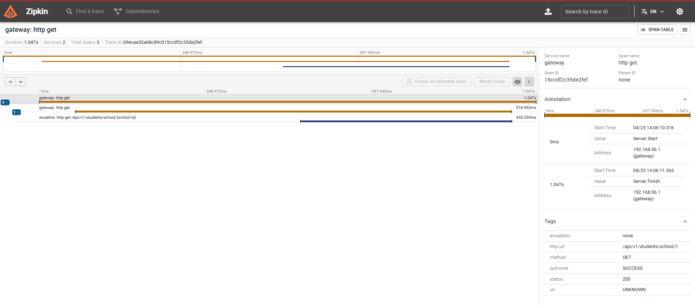

# Microservices Demo Project

This project demonstrates a simple microservices architecture using Spring Boot, Spring Cloud, Docker, and distributed tracing with Zipkin. The system is designed for educational purposes and showcases best practices for building scalable and observable microservices.

## Architecture Overview


- **API Gateway**: Entry point for all client requests. Routes traffic to the appropriate microservice.
- **Student Service**: Manages student data and operations. Connects to its own PostgreSQL database.
- **School Service**: Manages school data and operations. Connects to its own PostgreSQL database.
- **Eureka Discovery Server**: Service registry for dynamic discovery of microservices.
    
- **Config Server**: Centralized externalized configuration for all microservices.
- **Zipkin**: Distributed tracing system for monitoring and troubleshooting requests across services.
    
- **PostgreSQL (Docker)**: Each service uses its own isolated PostgreSQL instance running in Docker.

## Technologies Used

- **Java 17**
- **Spring Boot 3**
- **Spring Cloud 2022**
  - Spring Cloud Gateway
  - Spring Cloud Config
  - Spring Cloud Netflix Eureka
- **Spring Data JPA**
- **PostgreSQL**
- **Docker**
- **Zipkin (Distributed Tracing)**
- **Micrometer Tracing (Brave)**
- **Lombok**
- **Maven**

## Features

- Centralized configuration management via Spring Cloud Config Server.
- Service discovery and registration with Eureka.
- API Gateway for routing and load balancing.
- Distributed tracing with Zipkin for end-to-end request visibility.
- Each microservice has its own database (database-per-service pattern).
- Dockerized PostgreSQL databases for easy setup.
- Example endpoints for managing students and schools.


## How to Run

1. **From the project root, start the infrastructure containers:**
  ```bash
  docker compose up -d
  ```
  This will launch the PostgreSQL databases and Zipkin in the background.
2. **Start Config Server**:
  - Loads configuration from the `/configurations` directory.
3. **Start Eureka Discovery Server**.
4. **Start Student and School microservices**.
5. **Start API Gateway**.
6. Access endpoints via the API Gateway (e.g., `/students`, `/schools`).
7. View distributed traces in the Zipkin UI at [http://localhost:9411/zipkin/](http://localhost:9411/zipkin/).

## Example Endpoints

- `GET /api/v1/students` — List students
- `GET /api/v1/schools` — List schools

## Observability

- All HTTP requests are traced and sent to Zipkin.
- You can visualize and analyze traces in the Zipkin UI.

## Project Structure

```
microservices_21-04/
│
├── config-server/
├── discovery/
├── gateway/
├── school/
├── student/
└── docker-compose.yml
```

